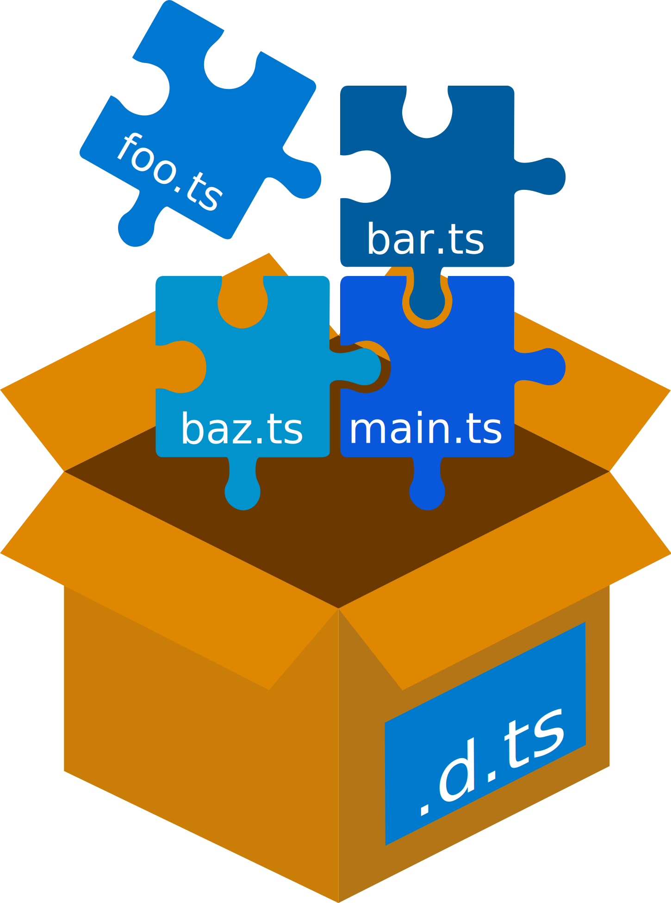

<!-- markdownlint-disable MD033 -->

<div align="center">
  <a href="https://github.com/timocov/dts-bundle-generator">
    
  </a>
</div>

# DTS Bundle Generator

[](https://badge.fury.io/js/dts-bundle-generator)
[](https://travis-ci.org/timocov/dts-bundle-generator)

Small tool to generate a dts bundle from your ts code.

For example:

```ts
// a.ts
export class A {}
```

```ts
// b.ts
export class B {}
```

```ts
// entry.ts
import { A } from './a';
import { B } from './b';

declare function makeA(): A;
export function makeB(): B {
    makeA();
    return new B();
}
```

When you run `dts-bundle-generator -o my.d.ts entry.ts` in `my.d.ts` you will get the following:

```ts
declare class B {
}
export declare function makeB(): B;
```

## Installation

1. Install the package from `npm`:
    ```bash
    npm install --save-dev dts-bundle-generator
    ```

    or

    ```bash
    npm install -g dts-bundle-generator
    ```

1. Enable `declaration` compiler option in `tsconfig.json`

## Usage

```
Usage: dts-bundle-generator.js [options] <file(s)>

Options:
  --help                        Show help                                                  [boolean]
  --out-file, -o                File name of generated d.ts                                 [string]
  --verbose                     Enable verbose logging                    [boolean] [default: false]
  --silent                      Disable any logging except errors         [boolean] [default: false]
  --no-check                    Skip validation of generated d.ts file    [boolean] [default: false]
  --fail-on-class               Fail if generated dts contains class declaration
                                                                          [boolean] [default: false]
  --external-inlines            Array of package names from node_modules to inline typings from.
                                Used types will be inlined into the output file              [array]
  --external-imports            Array of package names from node_modules to import typings from.
                                Used types will be imported using "import { First, Second } from
                                'library-name';".
                                By default all libraries will be imported (except inlined libraries
                                and libraries from @types)                                   [array]
  --external-types              Array of package names from @types to import typings from via the
                                triple-slash reference directive.
                                By default all packages are allowed and will be used according to
                                their usages                                                 [array]
  --umd-module-name             Name of the UMD module. If specified then `export as namespace
                                ModuleName;` will be emitted                                [string]
  --project                     Path to the tsconfig.json file that will be used for the compilation
                                                                                            [string]
  --sort                        Sort output nodes                         [boolean] [default: false]
  --inline-declare-global       Enables inlining of `declare global` statements contained in files
                                which should be inlined (all local files and packages from
                                `--external-inlines`)                     [boolean] [default: false]
  --disable-symlinks-following  (EXPERIMENTAL) Disables resolving of symlinks to the original path.
                                See https://github.com/timocov/dts-bundle-generator/issues/39 for
                                more information                          [boolean] [default: false]
  --config                      File path to the generator config file                      [string]
  --version                     Show version number                                        [boolean]
```

Examples:

```bash
./node_modules/.bin/dts-bundle-generator -o my.d.ts path/to/your/entry-file.ts
```

```bash
./node_modules/.bin/dts-bundle-generator path/to/your/entry-file.ts path/to/your/entry-file-2.ts
```

```bash
./node_modules/.bin/dts-bundle-generator --external-inlines=@mycompany/internal-project --external-imports=@angular/core,rxjs path/to/your/entry-file.ts
```

```bash
./node_modules/.bin/dts-bundle-generator --external-types=jquery path/to/your/entry-file.ts
```

## Config file

It is unnecessary, but you can use config file for the tool. See [config documentation](src/config-file/README.md) for more information.

## Why

If you have modules then you can create definitions by default using `tsc`, but `tsc` generates them for each module separately.
Yeah, you can use `outFile` (for `amd` and `system`), but generated code looks like this:

```ts
declare module "a" {
    export class A {
    }
}
declare module "b" {
    export class B {
    }
}
declare module "entry" {
    import { B } from "b";
    export function makeB(): B;
}
```

but:

1. `A` is not used at all and most probably you do not want to export it.
1. If you bundle your code in a way when all modules are merged (like when using Webpack or Rollup) then there should be no such modules as `a` or `b` (actually `entry` too) in the resulting file.

## Known limitations

1. Do not rename types on import. If you use something like this

    ```ts
    import { A as B } from './b';
    export C extends B {}
    ```

    you will get an error, because this tool does not follow your renaming (and actually cannot do that).

1. Do not use types from `* as name`-imports:

    ```ts
    import * as someName from './some';
    export class A extends someName.SomeClass {}
    ```

    This case is very similar to the previous one.

    **NOTE:** some libraries with typings in `@types` (for example `react` or `react-dom`) has named exported namespace.
    Since typings for these libraries are imported via triple-slash directive, you should import these libraries with renaming.
    For example for source

    ```ts
    import * as ReactDOM from 'react-dom';
    export interface MyRenderer extends ReactDOM.Renderer {}
    ```

    generated dts will be

    ```ts
    /// <reference types="react" />
    /// <reference types="react-dom" />

    export interface MyRenderer extends ReactDOM.Renderer {
    }
    ```

    So please **make sure** that your `* as name`-import has right `name`.

1. All your types should have different names inside a bundle. If you have 2 `interface Options {}` they will be merged by `TypeScript` and you will get wrong definitions.

1. Don't re-export default exports as default export in entry files.

    `class.ts`:

    ```ts
    export default class MyClass {}
    ```

    `index.ts`:

    ```ts
    export { default } from './class';
    ```

    This can be simply "fixed" via importing and then exporting as default:

    `index.ts`:

    ```ts
    import MyClass from './class';
    export default MyClass;
    ```
